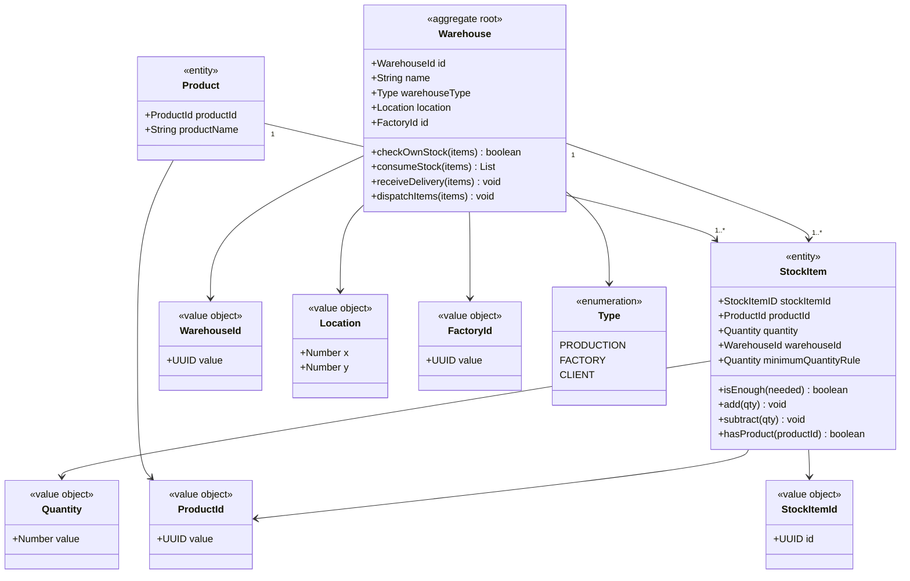
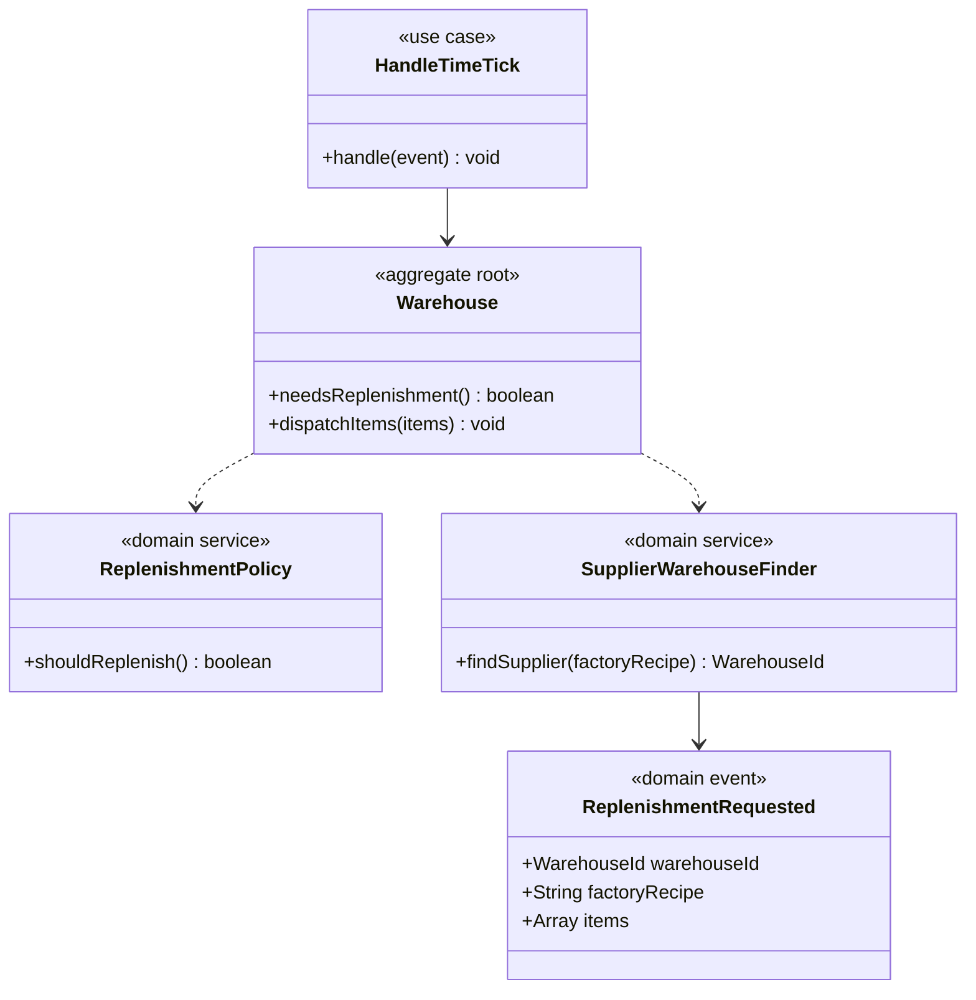
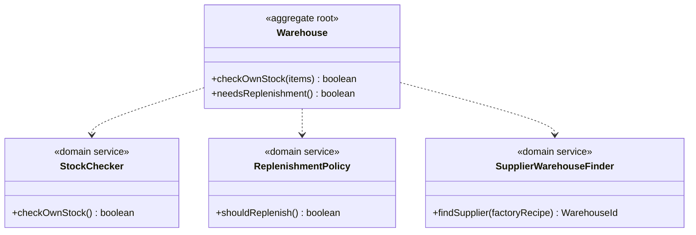
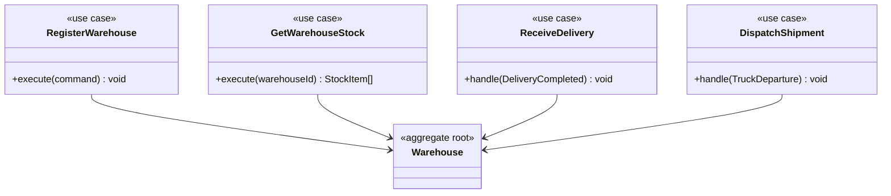
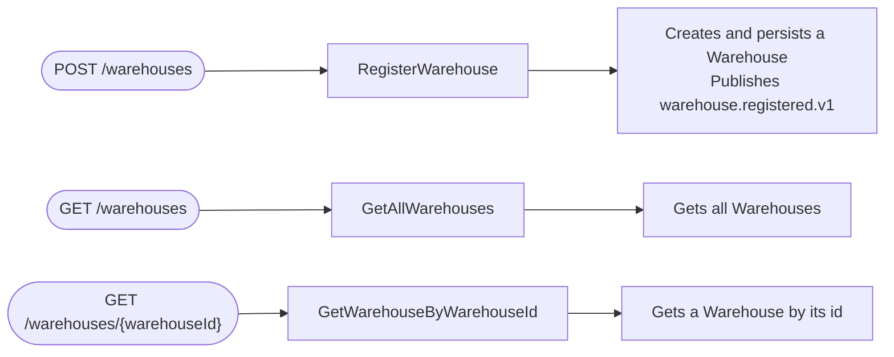
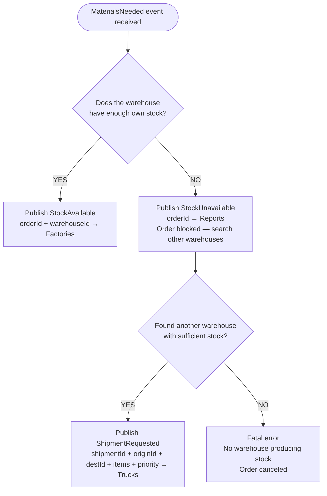

# Warehouses — Bounded Context (Core Domain)

## Module: warehouse



## Module: replenishment



## Module: services



## Use cases (Application Layer)



## REST



## Decision logic — production.materials.requested.v1



## Event Contracts

### RabbitMQ Infrastructure

| Constant | Value |
|---|---|
| `EXCHANGE` | `warehouses.exchange` |
| `TIME_EXCHANGE` | `ms-time.exchange` |
| `QUEUE_WAREHOUSE_CREATED` | `warehouse.registered.queue` |
| `ROUTING_KEY_WAREHOUSE_CREATED` | `warehouse.registered.v1` |
| `QUEUE_TIME_TICK` | `warehouse.time.tick.queue` |
| `ROUTING_KEY_TIME_TICK` | `time.advanced.v1` |

> **Note on time events:** `time.advanced.v1` is NOT consumed directly from `ms-time.exchange`. Instead, we declare our own queue (`warehouse.time.tick.queue`) bound to `ms-time.exchange` with routing key `time.advanced.v1`. The time exchange is declared with `setShouldDeclare(false)` since it is owned by the Time microservice.

---

### Events Published by Warehouse

| Event | Routing key | Exchange | Consumed by |
|---|---|---|---|
| WarehouseRegistered | `warehouse.registered.v1` | `warehouses.exchange` | Map, Reporting |
| ReplenishmentRequested | `replenishment.requested.v1` | `warehouses.exchange` | Production, Reporting |
| StockChanged | `warehouse.stock.changed.v1` | `warehouses.exchange` | Production, Reporting |
| ShipmentRequested | `shipment.requested.v1` | `warehouses.exchange` | Trucks |
| WarehouseOrderBlocked | `warehouse.order.blocked.v1` | `warehouses.exchange` | Reporting |
| MaterialsGiven | `materials.given.v1` | `warehouses.exchange` | Factory |
| ProductsUpdated | `product.catalogue.updated.v1` | `warehouses.exchange` | Factory |

#### `warehouse.registered.v1`
```json
{
  "warehouseId": "uuid",
  "name": "string",
  "location": { "x": 0, "y": 0 },
  "warehouseType": "PRODUCTION | FACTORY | CLIENT"
}
```

#### `replenishment.requested.v1`
```json
{
  "productId": "string",
  "quantity": 0,
  "type": "string"
}
```

#### `warehouse.stock.changed.v1`
```json
{
  "productId": "string",
  "quantity": 0,
  "type": "string"
}
```

#### `shipment.requested.v1`
```json
{
  "shipmentId": "uuid",
  "originId": "warehouse-north-01",
  "destinationId": "warehouse-south-03",
  "items": [{ "materialType": "wood", "quantity": 6 }],
  "requestedAt": 3
}
```

#### `warehouse.order.blocked.v1`
```json
{
  "orderId": "uuid"
}
```

#### `materials.given.v1`
```json
{
  "orderId" : "uuid"
  "items": [
    { "productId": "uuid", "quantity": 0 }
  ]
}
```

### `product.catalogue.updated.v1`
```json
{
  "status" : "string",
  "product" : {
        "productId" : "uuid",
        "productName" : "string"
    }
}
```

---

### Events Consumed by Warehouse

| Event | Routing key | Source exchange | Published by |
|---|---|---|---|
| TimeTick | `time.advanced.v1` | `ms-time.exchange` | Time |
| MaterialsRequested | `product.materials.requested.v1` | `warehouses.exchange` | Factory |
| ProductionOrderCompleted | `production.order.completed.v1` | `warehouses.exchange` | Factory |
| DeliveryCompleted | `delivery.completed.v1` | `warehouses.exchange` | Trucks |

#### `time.advanced.v1`
> Consumed via `warehouse.time.tick.queue` bound to `ms-time.exchange`
```json
{
  "tick": 0
}
```

#### `product.materials.requested.v1`
```json
{
  "orderId" : "uuid"
  "items": [
    { "productId": "uuid", "quantity": 0 }
  ]
}
```

#### `production.order.completed.v1`
```json
{
  "warehouseOrderId": "uuid",
  "productionOrderId": "uuid",
  "productId": "uuid",
  "factoryAsign": "uuid",
  "quantity": 0,
  "status": "enum"
}
```

#### `delivery.completed.v1`
```json
{
  "shipmentId": "uuid",
  "truckId": "uuid",
  "items": [{ "materialType": "wood", "quantity": 6 }],
  "location": { "x": 8, "y": 2 },
  "completedAt": 5
}
```

---

### Other microservices — event summary

#### Factory
| Direction | Event | Payload fields |
|---|---|---|
| Receives from Warehouse | `materials.given.v1` | `items[]{productId: UUID, quantity: int}` |
| Sends to Warehouse | `product.materials.requested.v1` | `items[]{productId: UUID, quantity: int}` |
| Sends to Warehouse | `production.order.completed.v1` | `warehouseOrderId, productionOrderId, productId, factoryAsign, quantity, status` |
| Receives from Warehouse | `product.catalogue.updated.v1` | `status: string(create || delete), product{productId: UUID, productName: string}` |

#### Map
| Direction | Event | Payload fields |
|---|---|---|
| Receives from Warehouse | `warehouse.registered.v1` | `warehouseId: UUID, name: String, location: {x,y}, warehouseType: enum` |

#### Trucks
| Direction | Event | Payload fields |
|---|---|---|
| Receives from Warehouse | `shipment.requested.v1` | `shipmentId, originId, destinationId, items[]{materialType, quantity}, requestedAt` |
| Sends to Warehouse | `delivery.completed.v1` | `shipmentId, truckId, items[]{materialType, quantity}, location{x,y}, completedAt` |

#### Reporting
| Direction | Event | Payload fields |
|---|---|---|
| Receives from Warehouse | `replenishment.requested.v1` | `productId: String, quantity: int, type: String` |
| Receives from Warehouse | `warehouse.stock.changed.v1` | `productId: String, quantity: int, type: String` |
| Receives from Warehouse | `warehouse.order.blocked.v1` | `orderId: UUID` |
