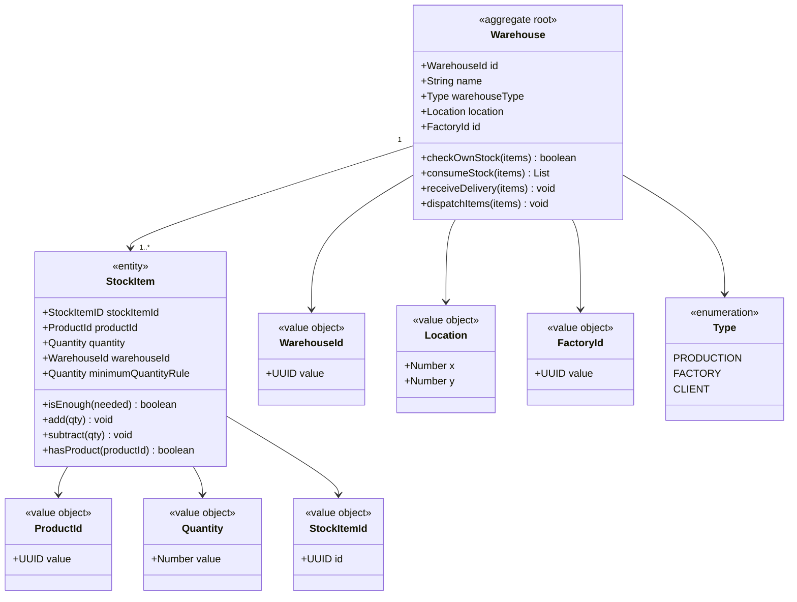
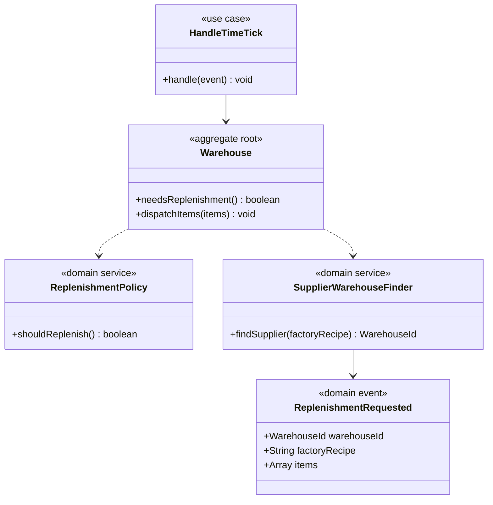
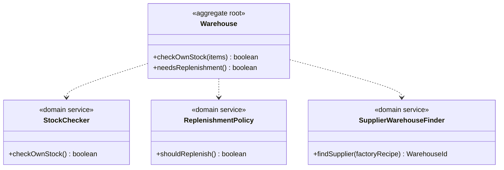
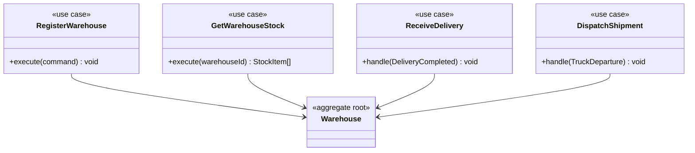

# Warehouses — Bounded Context (Core Domain)

## Module: warehouse



## Module: replenishment



## Module: services



## Use cases (Application Layer)



## REST


## Decision logic — production.materials.requested.v1


### Events published

| Event | Consumed by |
|---|---|
| `replenishment.requested.v1` | Reporting |
| `warehouse.stock.changed.v1` | Reporting |
| `shipment.requested.v1` | Transport |
| `warehouse.registered.v1` | Time/Map |
| `materials.given.v1` | Factory |
| `(warehouse.order.blocked.v1)` | Reporting *(pendiente)* |

### Events consumed

| Event | Published by |
|---|---|
| `time.advanced.v1` | Time |
| `product.materials.requested.v1` | Factory |
| `production.order.completed.v1` | Factory |
| `delivery.completed.v1` | Transport |

---

## Event Contracts

### `time.advanced.v1`

Tick periódico del servicio Time. Dispara la lógica de reabastecimiento.

- **Exchange:** `ms-time.exchange` (`setShouldDeclare=false`, externo)
- **Routing key:** `time.advanced.v1`
- **Queue:** `warehouse.time.tick.queue`
- **Emitter:** Time
- **Action:** Verificar stock mínimo de todos los almacenes y publicar `replenishment.requested.v1` si procede.

---

### `product.materials.requested.v1`

Solicitud de Factory al almacén para verificar si tiene stock de los materiales pedidos.

- **Emitter:** Factory
- **Action:** Comprobar stock → publicar `materials.given.v1` o `warehouse.order.blocked.v1`

| Field | Type |
|---|---|
| `orderId` | UUID |
| `factoryId` | UUID |
| `warehouseId` | UUID |
| `items[].ingredientId` | UUID |
| `items[].quantity` | int |

```json
{
  "orderId":     "c9d8e7f6-a5b4-3210-9876-543210fedcba",
  "factoryId":   "c9d8e7f6-a5b4-3210-9876-543210fedcba",
  "warehouseId": "c9d8e7f6-a5b4-3210-9876-543210fedcba",
  "items": [
    { "ingredientId": "c9d8e7f6-a5b4-3210-9876-543210fedcba", "quantity": 6 },
    { "ingredientId": "c9d8e7f6-a5b4-3210-9876-543210fedcba", "quantity": 12 }
  ]
}
```

---

### `materials.given.v1`

Respuesta del almacén a Factory confirmando entrega de materiales.

- **Exchange:** `warehouses.exchange`
- **Emitter:** Warehouse → Factory

| Field | Type |
|---|---|
| `items[].productId` | UUID |
| `items[].quantity` | int |

---

### `production.order.completed.v1`

Notificación de Factory al almacén indicando que una orden de producción ha finalizado.

- **Emitter:** Factory
- **Action:** Añadir el producto fabricado al stock del almacén.

| Field | Type |
|---|---|
| `warehouseOrderId` | UUID |
| `productionOrderId` | UUID |
| `productId` | UUID |
| `factoryAsign` | UUID |
| `quantity` | int |
| `status` | enum |

```json
{
  "warehouseOrderId":  "c9d8e7f6-a5b4-3210-9876-543210fedcba",
  "productionOrderId": "c9d8e7f6-a5b4-3210-9876-543210fedcba",
  "productId":         "c9d8e7f6-a5b4-3210-9876-543210fedcba",
  "factoryAsign":      "c9d8e7f6-a5b4-3210-9876-543210fedcba",
  "quantity": 6,
  "status": "COMPLETED"
}
```

---

### `warehouse.registered.v1`

Publicado por el almacén al registrarse. Time/Map lo usa para mostrar el almacén en el mapa.

- **Exchange:** `warehouses.exchange`
- **Routing key:** `warehouse.registered.v1`
- **Emitter:** Warehouse → Time/Map

| Field | Type |
|---|---|
| `warehouseId` | UUID |
| `name` | String |
| `location.x` | Number |
| `location.y` | Number |
| `warehouseType` | WarehouseType |

---

### `shipment.requested.v1`

Publicado por el almacén cuando necesita transportar stock entre almacenes.

- **Exchange:** `warehouses.exchange`
- **Emitter:** Warehouse → Transport

| Field | Type |
|---|---|
| `shipmentId` | UUID |
| `originId` | String |
| `destinationId` | String |
| `items[].materialType` | String |
| `items[].quantity` | int |
| `requestedAt` | int (tick) |

```json
{
  "shipmentId":      "uuid",
  "originId":        "warehouse-north-01",
  "destinationId":   "warehouse-south-03",
  "items":           [{ "materialType": "wood", "quantity": 6 }],
  "requestedAt":     3
}
```

---

### `delivery.completed.v1`

Publicado por Transport cuando un camión completa la entrega al almacén.

- **Emitter:** Transport → Warehouse
- **Action:** Llamar a `receiveDelivery` en el almacén destino.

| Field | Type |
|---|---|
| `shipmentId` | UUID |
| `truckId` | UUID |
| `items[].materialType` | String |
| `items[].quantity` | int |
| `location.x` | Number |
| `location.y` | Number |
| `completedAt` | int (tick) |

```json
{
  "shipmentId":  "uuid",
  "truckId":     "uuid",
  "items":       [{ "materialType": "wood", "quantity": 6 }],
  "location":    { "x": 8, "y": 2 },
  "completedAt": 5
}
```

---

### `replenishment.requested.v1`

Publicado por el almacén cuando detecta stock por debajo del mínimo.

- **Exchange:** `warehouses.exchange`
- **Emitter:** Warehouse → Reporting

| Field | Type |
|---|---|
| `productId` | String |
| `quantity` | int |
| `type` | String |

---

### `warehouse.stock.changed.v1`

Publicado cuando el stock de un almacén cambia (entrada o salida).

- **Exchange:** `warehouses.exchange`
- **Emitter:** Warehouse → Reporting

| Field | Type |
|---|---|
| `productId` | String |
| `quantity` | int |
| `type` | String |

---

### `(warehouse.order.blocked.v1)` *(pendiente de definir)*

Publicado cuando no hay stock suficiente en ningún almacén para atender una orden.

- **Exchange:** `warehouses.exchange`
- **Emitter:** Warehouse → Reporting

---

## RabbitMQ — Exchange & Queue summary

| Exchange | Tipo | Declarado por |
|---|---|---|
| `warehouses.exchange` | Topic | Warehouse |
| `ms-time.exchange` | Topic | Time *(externo, `shouldDeclare=false`)* |

| Queue | Routing key | Exchange |
|---|---|---|
| `warehouse.registered.queue` | `warehouse.registered.v1` | `warehouses.exchange` |
| `warehouse.time.tick.queue` | `time.advanced.v1` | `ms-time.exchange` |

---

## CONTRACTS
### `production.materials.requested.v1`

Request from production for warehouse to check if items requested are in stock.

| Field | Type | Notes |
|---|---|---|
| `orderId` | String (UUID) |  |
| `factoryId` | String (UUID) |  |
| `warehouseId` | String (UUID) |  |
| `items[]` | Array of Value Objects | Ingredient Items |
| `items[].ingredientId` | String (UUID) | Id of ingredient material  |
| `items[].quantity` | Integer | Quantity of material required |

**Consumed from:** 
**Emitter:** Factories

**Action:** 

```json
{
  "shipmentId": "c9d8e7f6-a5b4-3210-9876-543210fedcba",
  "factoryId": "c9d8e7f6-a5b4-3210-9876-543210fedcba",
  "warehouseId": "c9d8e7f6-a5b4-3210-9876-543210fedcba",
  "items": [
    { "ingredientId": "c9d8e7f6-a5b4-3210-9876-543210fedcba", "quantity": 6 },
    { "ingredientId": "c9d8e7f6-a5b4-3210-9876-543210fedcba", "quantity": 12 }
  ]
}
```

---

### `production.order.completed.v1`

Request from production for warehouse to check if items requested are in stock.

| Field | Type | Notes |
|---|---|---|
| `orderId` | String (UUID) |  |
| `factoryId` | String (UUID) | factoryAssigned |
| `warehouseId` | String (UUID) |  |
| `productId` | String (UUID) | resulting created product |
| `quantity` | int | resulting product quantity |
? | `status` | enum | order status, perhaps unnecessary |


**Consumed from:** 
**Emitter:** Factories

**Action:** 

```json
{
  "warehouseOrderId":  "c9d8e7f6-a5b4-3210-9876-543210fedcba",
  "productionOrderId": "c9d8e7f6-a5b4-3210-9876-543210fedcba",
  "productId":         "c9d8e7f6-a5b4-3210-9876-543210fedcba",
  "factoryAsign":      "c9d8e7f6-a5b4-3210-9876-543210fedcba",
  "quantity": 6,
  "status": "COMPLETED"
}
```

---
